# Facebook Token Instructions

## Create Apps and Tokens

Below are the instructions to create a facebook token for your page.

1. Log-into Facebook using a desktop computer. IMPORTANT: Log in using an account that has admin rights to the Facebook page you'd like to pull the posts from.

2. Go to [http://developers.facebook.com](http://developers.facebook.com) and click on the My Apps link on the top right part of the page.

3. Click on Add New App.

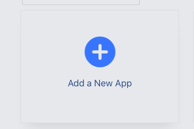

4. Select Manage Business Integrations

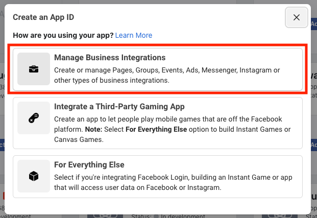

5. Fill in the Display name and the Contact Email fields and click on Create App ID. Select Just me... and then hit Create App Id

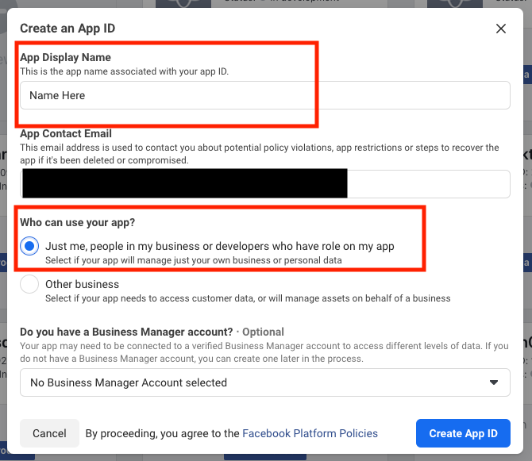

6. After creating the application, go to [http://developers.facebook.com/tools/explorer](http://developers.facebook.com/tools/explorer) and click on the Facebook App dropdown on the upper right part of the page. Select the application you just created.

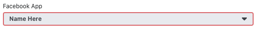

7. After selecting your application, click on the User or Page dropdown right below the Facebook App dropdown and select Get User Access Token. It should open a new window.

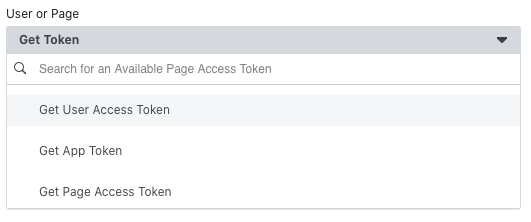

8. In the new window select continue as "Your Account".

9. After the window closes, make sure pages_show_list, pages_read_engagement, pages_manage_metadata, pages_manage_ads, pages_read_user_content, public_profile are checked. Click on Get Access Token.

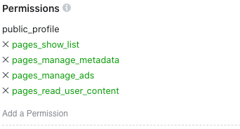

8, Click on the blue information icon to the right of Access Token. A box should pop-up. In the box, click on Open in Access Token Tool. It should take you to another window.

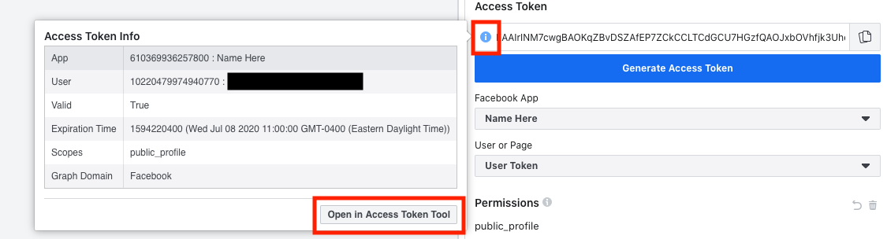

9. In the new window, click on Extend Access Token. Then click the Debug button, in the next tab copy the token in the input box

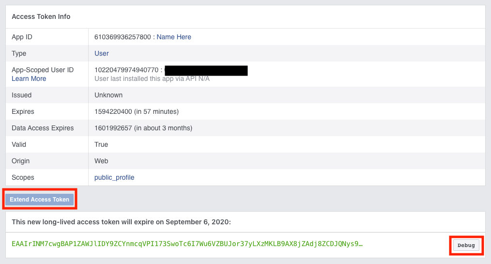

10. Go back to the original window and replace the access token with the one you copied.

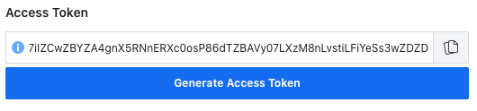

11. Change me?fields=id,name to me/accounts and click on Submit.

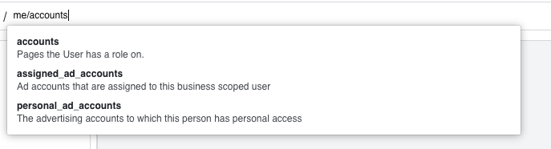

12. Click on Copy Debug Information and paste it in to a reply to your support ticket

## Delete Apps

1. If you need to delete an App, click on the My Apps Dropdown

2. Click See All Apps Option

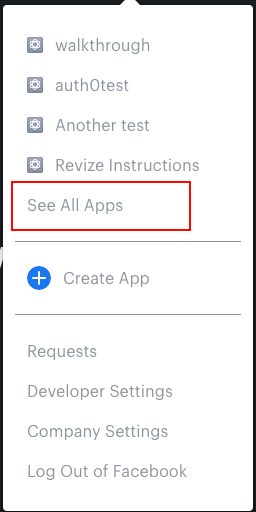

3. Hover over the App you want to delete and click the down arrow that appears

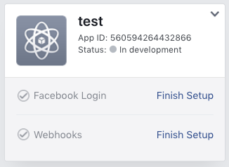

4. Click the delete app option

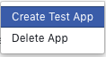

5. In the popup click delete app

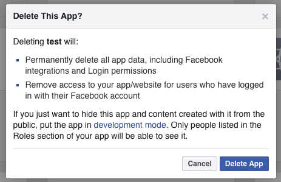

6. Then reenter your password and submit. Once submitted your app will be deleted.

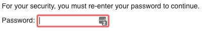
