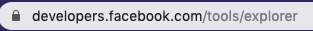

# Facebook Token Instructions

## Create Apps and Tokens
Below are the instructions to create a facebook token for your page.

1. Login to Facebook using a Desktop Computer. **IMPORTANT:** Login using an account that has admin rights to the Facebook page your would like to pull posts from.


2. Click on Add New App.


3. Fill the Display Name and Contact Email and click Create App ID


4. After creating the application, go to [https://developers.facebook.com/tools/explorer](https://developers.facebook.com/tools/explorer).



5. click on the Application dropdown on the upper right part of the page. Select the application you just created.


6. After selecting your application, click on the Get Token dropdown right below the Appliction dropdown and select Get User Access Token. It might open up a new window. **If it doesn't please check that popup blocker isn't active.**


7. In that window, select manage_pages and pages_show_list, then click Get Access Token


8. Click on the blue icon to the right most side of the Access Token input box.


9. A box should pop-up. In the box, click on Open in Access Token Tool. This will open up a new tab.


10. In the new tab, click on Extend Access Token.


11. A new box should show up, there click on the Debug button. This will open another new Tab.


12. Go back to the first tab (Graph API Explorer) and replace the access token with the one from the last tab that was opened


13. Change ```me?fields=id,name``` to ```me/accounts``` and click submit


14. Once done copy and paste the debug information to the email or support ticket

<!-- ## Delete Apps

1. If you need to delete an App please go  -->