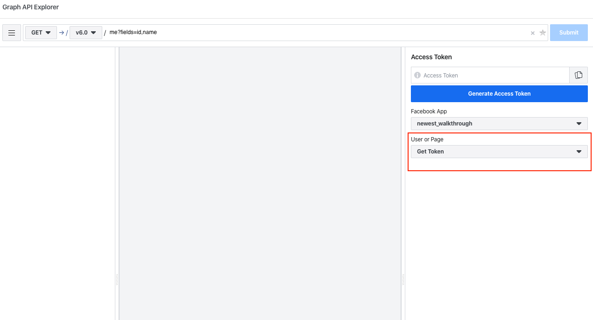

# Facebook Token Instructions

## Create Apps and Tokens
Below are the instructions to create a facebook token for your page.

1. Login to Facebook using a Desktop Computer. **IMPORTANT:** Login using an account that has admin rights to the Facebook page your would like to pull posts from. Then go to [https://developers.facebook.com](https://developers.facebook.com)


2. Click on Add New App.


3. Fill the Display Name and Contact Email and click Create App ID


4. After creating the application, go to [https://developers.facebook.com/tools/explorer](https://developers.facebook.com/tools/explorer).


5. Select your App from the drop down


6. Then select "Get User Access Token" from the User or Page Select



- You will get a new window where it askes to verify if you want to continue with this account.

7. Under Permissions select the two options for manage_pages and pages_show_list


8. Click Generate Access Token


9. In the next popup, select "Continue as `<your account>`", then select the page you want to show. On the next option make sure all options are selected and click "Done". Once it finishes click "OK"

10. Click the blue "i" icon next to the access token


11. Then in the new popup select "Open in Access Token Tool"


12. Once the new tab loads go down to the bottom and click "Extend Access Token"


13. Re-enter your password in the popup.

14. Then click the "Debug" button


15. In the new tab select all the text in the box


16. Go back to the original tab "Graph API Explorer" and paste the copied text into the access token box


17. Change the ```me?fields=id,name``` to ```me/accounts``` then click submit


18. Then click "Copy Debug Information" paste the debug information to the email or support ticket


## Delete Apps

1. If you need to delete an App, click on the My Apps Dropdown


2. Click See All Apps Option


3. Hover over the App you want to delete and click the down arrow that appears


4. Click the delete app option


5. In the popup click delete app


6. Then reenter your password and submit. Once submitted your app will be deleted.


